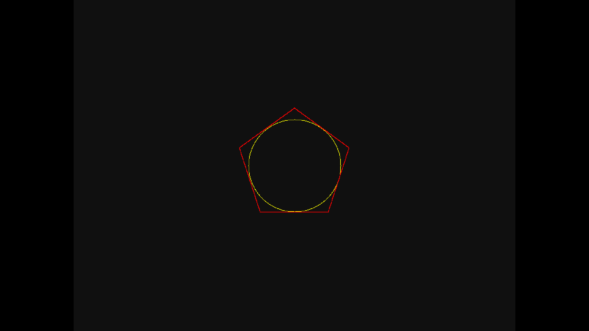
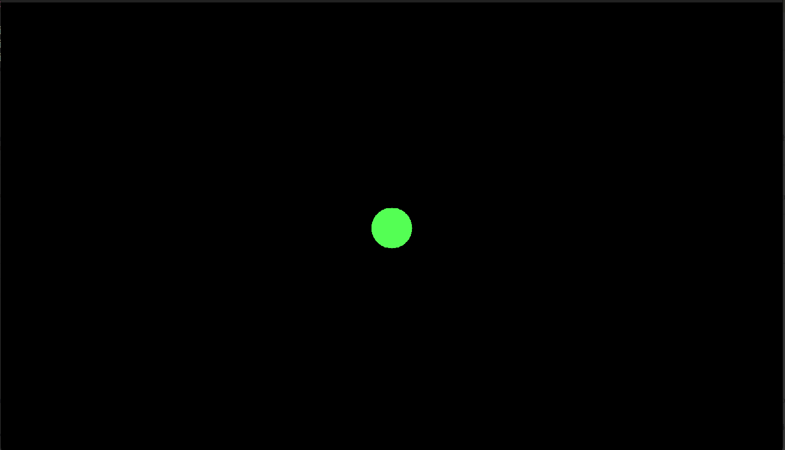
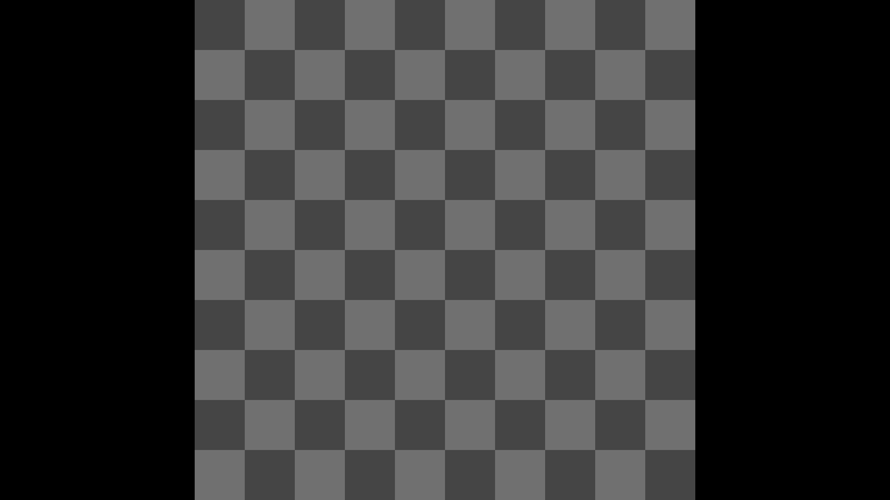
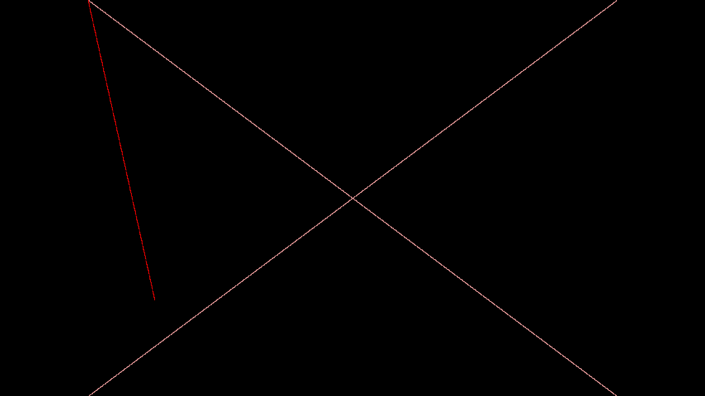

# Basic PPM Renderer

PPM is a very simple format used for primarily the generation of images, rather than for storing purposes.

## PPM

In this repository, the format used is the P6 format, which asks for the memory dump as the data, instead of ASCII values.
Format:

```ppm
P6
WIDTH HEIGHT 255
...
<data>
...
```

## Rendered images, converted into png:

- Regular Polygon with its in-circle.
  
- Linear Interpolated Circles
  
- Simple Circle
  
- Checkerboard
  
- Lines
  
